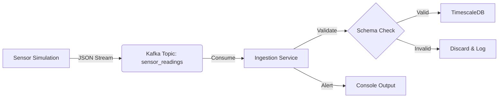
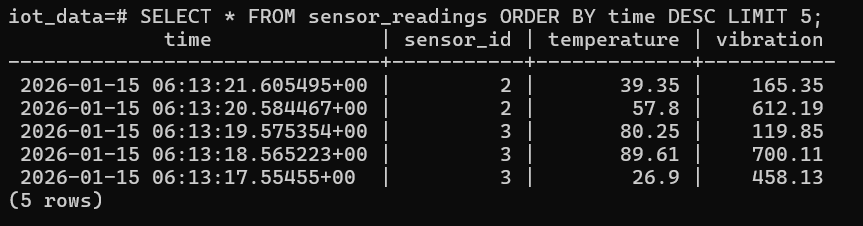
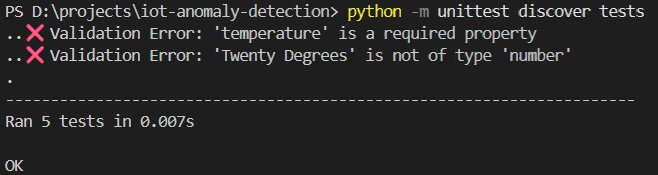

# Real-Time IoT Anomaly Detection Platform 🚀


An end-to-end data engineering pipeline that ingests high-velocity IoT sensor data, processes it in real-time to detect anomalies (e.g., overheating), and stores it for historical analysis.

---

## 🏗 Architecture
The system follows a decoupled **Event-Driven Architecture**:



1.  **Producer (Source):** Simulates IoT devices sending Temperature/Vibration data (serialized to JSON).
2.  **Message Broker:** **Apache Kafka** buffers the stream, ensuring zero data loss during spikes.
3.  **Consumer (Sink):**
    * **Validation:** Uses `jsonschema` to block malformed data ("Poison Pills").
    * **Processing:** Detects anomalies (Temperature > 80°C) in real-time.
    * **Storage:** Persists data to **TimescaleDB** (PostgreSQL) Hypertable for time-series efficiency.

---

## 📸 Project Demo

### 1. Real-Time Processing
*Left: Sensor generating data. Right: Consumer detecting High Temp Alerts.*


### 2. Data Persistence (TimescaleDB)
*SQL query confirming data is safely stored in the Hypertable.*


### 3. Reliability Testing
*Unit tests verifying the schema validation logic.*


### 4. Infrastructure
*Docker containers running the full stack.*


---

## 🛠 Tech Stack
* **Language:** Python 3.10
* **Streaming:** Apache Kafka & Zookeeper (Confluent Image)
* **Database:** TimescaleDB (PostgreSQL 14)
* **Infrastructure:** Docker & Docker Compose
* **Libraries:** `kafka-python`, `psycopg2`, `jsonschema`

---

## 🚀 How to Run

### Prerequisites
* Docker Desktop installed and running.
* Python 3.10+

### Step 1: Start Infrastructure
Spin up Kafka, Zookeeper, and TimescaleDB containers.
```bash
docker-compose up -d
```
*Verify they are running with `docker ps`.*

### Step 2: Setup Environment
```bash
conda create -n iotenv python=3.10 -y
conda activate iotenv
pip install -r requirements.txt
```

### Step 3: Run the System
**Option A: VS Code (Recommended)**
1.  Go to **Run and Debug** (Sidebar).
2.  Select **"Run Full System"**.
3.  Press **F5**. (Opens split terminals automatically).

**Option B: Manual Terminal**
Terminal 1 (Producer):
```bash
python -m data_simulation.main
```
Terminal 2 (Consumer):
```bash
python -m ingestion.main
```

### Step 4: Verify Storage
To check the database manually:
```bash
docker exec -it timescaledb psql -U admin -d iot_data
```
Inside the SQL Prompt:
```sql
SELECT * FROM sensor_readings ORDER BY time DESC LIMIT 5;
```

---

## 🧪 Testing
Run the unit test suite to verify data validation rules:
```bash
python -m unittest discover tests
```